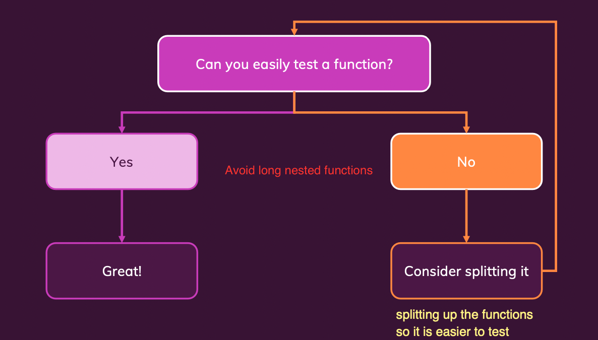

# Introduction

### What is Clean Code?

- Should be readable and meaningful
- Should reduce cognitive load
- Should be concise and "to the point"
- Should avoid unintuitive names, complex nesting and big code blocks
- Should follow common best practices and patterns
- Should be fun to write and to maintain

# Naming - Assigning Names to Variables, Functions and Classes

### How to name things correctly?

- **Variables & constants**: Use nouns or short phrases with adjectives.
- **Functions/Methods**: Use verbs or short phrases with adjectives.
- **Classes**: Use nouns or short phrases wisth nouns.

|snake_case|camelCase|PascalCase|kebab-case|
|:-:|:-:|:-:|:-:|
|is_valid, send_response|isValid, sendResponse|AdminRole, UserRepository|`<side-drawer>`|
|e.g., Python|e.g., Java, JavaScript|e.g., Python, Java, JavaScript|e.g., HTML|
|Variables, functions, methods|Variables, functions, methods|Classes|Custom HTML Elements|

### Naming Variables, Constants & Properties

|Value is an Object|Value is Number or String|Value is a Boolean|
|:-:|:-:|:-:|
|Describe the value|Describe the value|Answer a true/false question|
|`user, database`|`name, age`|`isActive, loggedIn`|
|Provide more details without introducing redundancy.|Provide more details without introducing redundancy.|Provide more details without introducing redundancy.|
|`authenticatedUser, sqlDatabase`|`firstName, age`|`isActiveUser, loggedIn`|

### Naming Functions & Methods

|Function performs an operation|Function computers a Boolean|
|:-:|:-:|
|Describe the operation|Answer a true/false question|
|`getUser(..), response.send()`|`isValid(..), purchase.isPaid()`|
|Provide more details without introducting redundancy|Provide more details without introducing redundancy|
|`getUserByEmail(..), reponse.send()`|`emailIsValid(..), purchase.isPaid()`|

### Naming Classes 

|Describe the Object|
|`User, Product`|
|Provide more details without introducing redundancy|
|`Customer, Course`|

- Avoid redundant suffixes, E.g., `DatabaseManager`. Instatiating a `DatabaseManager` makes no sense.

### Don't include redundant informatino in Names

- E.g., `userWithNameAndAge = User("Max", 31)`
- Even without knowing the class definition, it's easy to guess that this user has a name and age.
- In general, it's expected that a "User" will contain some user data.
- Names should avoid describing unnecessary or redundant details.
- `user = User("Max", 31)` or `newUser` or `loggedInUser`

### Avoid Slang, Unclear Abbreviations & Definitinos

|Type|Avoid|Do|
|:-:|:-:|:-:|
|Slang|`product.diePlease(), user.facePalm()`|`product.remove(), user.sendErrorMessage()`|
|Unclear Abbreviations|`message(n), ymdt='20210121CET'`|`message(newUser), dateWithTimezone = '20210121CET'`|
|Disinformation|`userList = {u1: .., u2: ..}, allAccounts = accounts.filter()`|`userMap = {u1: ..., u2: ...}, filteredAccounts = accounts.filter()`|

### Be consistent

- The following methods do the same functions: `getUsers(), fetchUsers(), retrieveUsers()`
- Can go with either of these options but stick with it throughout the entire program.

# Code Structure, Comments & Formatting

### Bad Comments

- Redundant Information
- Dividers / Block Markers
- Misleading Comments
- Commented-Out Code

### Good Comments

- Legal Information. E.g., *(c) Low Jie Wei / Company Name*
- Explanations which can't be replaced by good naming. E.g., *regular expressions*
- Warnings
- Todo Notes

### Code Formatting

- Code Formatting improves readability and transports meaning.
- Vertical formatting
    - Space between lines
    - Grouping of Code
- Horizontal formatting
    - Indentation
    - Space between code
    - Line width
- Formatting rules differ between languages (seach language style guide)

#### Vertical Formatting

- Code should be readable like an essay - top to bottom without too many "jumps"
    - Consider splitting files with multiple concepts (e.g., classes) into multiple files.
    - Different concepts ("areas") should be separated by spacing.
    - Similar concepts ("areas") shoould not be separated by spacing.
    - Related concepts should be kept close to each other.

#### Horizontal Formatting

- Lines of code should be readable without scrolling - avoid very long "sentences"
    - Use indentation - even if not requireed technically.
    - Break long statements into multiple shorter ones
    - Use clear but not unreadably long names.

# Functions & Methods

### The number of parameters matters!

|No. of Parameters|Description|
|:-:|:-:|
|None|Easy to understand|
|1|Easy to understand|
|2|Decent to understand|
|3|Challenging to understand|
|4 or more|Difficult to read & understand|

### Different Levels of Abstraction

- The following code contains 2 operations: `Operation 1 + Operation 2` (`Validate + Save User Input`)
- `email.includes("@")` is a Low-level API operation on a string. 
- `saveUser(email, password`) is a high-level, developer-defined function for saving a user.
- Such different levels of abstraction should be avoided. 

```
email.includes("@") + saveUser(email, password)
```

- Create a function to turn it into a high level of abstraction
    - `emailIsValid(email)`

```
function emailIsValid(email) {
    return email.includes("@")
}
```

### Try not to mix level of abstraction

- (Bad) Need to read, understand and interpret the different steps. 

```
if (!email.includes("@")) {
    console.log("Invalid email")
} else {
    const user = new User(email)
    user.save()
}
```

- (Good) Just need to read the different steps

```
if (!isEmail(email)) {
    showError("Invalid email!")
} else {
    saveNewUser(email)
}
```

### Unit Testing



# Control Structures and Errors

# Classes & Objects

### 